# 任务D基础实验记录：基于 DCGAN 的人脸图像生成

本文档整理任务D基础实验部分，包括数据集、模型、训练设置、调参过程、最终结果和报告中可直接使用的文字。报告撰写同学可以基于本文档补充图片和分析后整合进最终报告。

## 1. 实验目标

本实验目标是实现一个基础 GAN 模型，用于人脸图像生成。我们选择 DCGAN 作为基础模型，在 CelebA aligned face 数据集上进行训练，并完成以下内容：

- 实现 DCGAN 的生成器和判别器。
- 使用真实人脸数据进行对抗训练。
- 从随机噪声生成 64x64 RGB 人脸图像。
- 进行潜变量空间线性插值实验。
- 使用 FID 和 Inception Score 评估生成图像质量。
- 通过调参实验选择最终训练配置。

## 2. 数据集与预处理

使用数据集：CelebA aligned face images。

服务器上的原始图片路径为：

```text
data/celeba_hf/img_align_celeba/
```

由于 `torchvision.datasets.ImageFolder` 要求数据目录必须具有“类别子目录”结构，因此实际训练时创建了一个干净的 ImageFolder 入口：

```text
data/celeba_imagefolder/
  faces -> data/celeba_hf/img_align_celeba/
```

其中 `faces` 是唯一类别目录。GAN 训练不使用类别标签，因此一个类别目录即可满足读取要求。

CelebA aligned images 的图片数量约为：

```text
202599
```

图像预处理流程：

- 将图片 resize 到 64 像素。
- 中心裁剪为 `64 x 64`。
- 训练时随机水平翻转。
- 转换为 PyTorch tensor。
- 将 RGB 三通道归一化到 `[-1, 1]`。

归一化到 `[-1, 1]` 是为了与生成器最后一层 `Tanh()` 的输出范围保持一致。

## 3. 模型结构

本实验实现的是标准 DCGAN。

### 3.1 生成器 Generator

输入为随机噪声：

```text
z: [N, 128, 1, 1]
```

输出为生成图像：

```text
fake_images: [N, 3, 64, 64]
```

生成器使用多层转置卷积进行上采样，每层主要由以下模块构成：

```text
ConvTranspose2d + BatchNorm2d + ReLU
```

最后一层使用：

```text
ConvTranspose2d + Tanh
```

因此生成图像的像素范围为 `[-1, 1]`。

### 3.2 判别器 Discriminator

输入为真实图像或生成图像：

```text
images: [N, 3, 64, 64]
```

输出为每张图像为真实图像的概率：

```text
probability: [N]
```

判别器使用多层卷积进行下采样，每层主要由以下模块构成：

```text
Conv2d + BatchNorm2d + LeakyReLU
```

最后通过 `Sigmoid()` 输出真假概率。

## 4. 训练设置

损失函数：

```text
Binary Cross Entropy Loss
```

标签设置：

- 真实图像标签为 `1`。
- 训练判别器时，生成图像标签为 `0`。
- 训练生成器时，希望判别器将生成图像判断为真实图像，因此生成图像目标标签为 `1`。

优化器：

```text
Adam
beta1 = 0.5
beta2 = 0.999
```

基础 DCGAN 默认设置：

```text
noise_dim = 128
image_size = 64
channels = 3
lr = 0.0002
```

训练硬件：

```text
RTX 4090
```

## 5. 调参过程

为了选择更稳定、效果更好的训练配置，先进行了短轮次调参。每组候选参数训练 10 epoch，并使用 512 张真实/生成图像计算 FID 和 Inception Score。

FID 越低越好，表示生成图像分布与真实图像分布越接近。Inception Score 越高通常越好，但由于本任务是单一人脸领域，IS 的解释力弱于 FID。

### 5.1 第一轮调参结果

| 实验名称 | Epoch | Batch Size | 学习率 | G 特征图数 | D 特征图数 | 评估图像数 | FID ↓ | IS Mean ↑ | IS Std |
|---|---:|---:|---:|---:|---:|---:|---:|---:|---:|
| baseline_bs128_lr2e4_g64_d64 | 10 | 128 | 0.0002 | 64 | 64 | 512 | 42.969657 | 2.151910 | 0.139300 |
| stable_bs128_lr1e4_g64_d64 | 10 | 128 | 0.0001 | 64 | 64 | 512 | 41.254318 | 2.099377 | 0.236558 |
| smallbatch_bs64_lr2e4_g64_d64 | 10 | 64 | 0.0002 | 64 | 64 | 512 | 41.029545 | 2.071303 | 0.131560 |
| largerg_bs64_lr2e4_g128_d64 | 10 | 64 | 0.0002 | 128 | 64 | 512 | 39.744449 | 1.991915 | 0.073469 |

第一轮调参观察：

- 将 batch size 从 128 减小到 64 后，FID 有所下降。
- 将生成器容量从 `G=64` 增大到 `G=128` 后，FID 进一步下降。
- 第一轮中 FID 最低的配置为：

```text
batch_size = 64
lr = 0.0002
feature_maps_g = 128
feature_maps_d = 64
```

不过该组 Inception Score 略低。考虑到人脸生成是单领域生成任务，最终选择时主要参考 FID 和生成图像视觉质量。

### 5.2 Batch Size 32 补充实验

第一轮结果显示减小 batch size 有助于降低 FID，因此进一步尝试 `batch_size=32`，并保持较大的生成器容量。

| 实验名称 | Epoch | Batch Size | 学习率 | G 特征图数 | D 特征图数 | 评估图像数 | FID ↓ | IS Mean ↑ | IS Std |
|---|---:|---:|---:|---:|---:|---:|---:|---:|---:|
| bs32_g128_d64 | 10 | 32 | 0.0002 | 128 | 64 | 512 | 33.242528 | 2.046479 | 0.103860 |

补充实验观察：

- `batch_size=32` 将 FID 从上一轮最优的 `39.744449` 进一步降至 `33.242528`。
- IS 没有明显下降。
- 因此，`batch_size=32, G=128, D=64` 成为新的最优候选配置。

## 6. 二阶段训练结果

为了验证该配置是否能在更长训练中继续稳定提升，将最优候选配置训练到 30 epoch，并使用 2048 张图像进行评估。

| 实验名称 | Epoch | Batch Size | 学习率 | G 特征图数 | D 特征图数 | 评估图像数 | FID ↓ | IS Mean ↑ | IS Std |
|---|---:|---:|---:|---:|---:|---:|---:|---:|---:|
| bs32_g128_d64 | 30 | 32 | 0.0002 | 128 | 64 | 2048 | 19.603397 | 2.191921 | 0.125271 |

二阶段训练观察：

- FID 从 10 epoch 的 `33.242528` 降至 30 epoch 的 `19.603397`。
- 说明该配置训练稳定，并且随着训练轮数增加，生成质量继续提升。
- 因此选择该配置进行最终训练。

## 7. 最终训练结果

最终选定配置如下：

```text
batch_size = 32
lr = 0.0002
feature_maps_g = 128
feature_maps_d = 64
epochs = 50
```

最终评估使用 4096 张图像。

| 实验名称 | Epoch | Batch Size | 学习率 | G 特征图数 | D 特征图数 | 评估图像数 | FID ↓ | IS Mean ↑ | IS Std |
|---|---:|---:|---:|---:|---:|---:|---:|---:|---:|
| final_bs32_g128_d64 | 50 | 32 | 0.0002 | 128 | 64 | 4096 | 16.393850 | 2.093219 | 0.070783 |

最终结果观察：

- FID 从 30 epoch 的 `19.603397` 进一步降至 50 epoch 的 `16.393850`。
- 说明继续训练到 50 epoch 仍然有效。
- 最终 `FID=16.393850`，可以作为任务D基础部分的主要定量结果。
- Inception Score 为 `2.093219`。由于人脸数据属于单一类别分布，IS 不如 FID 具有解释力，因此报告中应主要强调 FID。

最终生成样本：

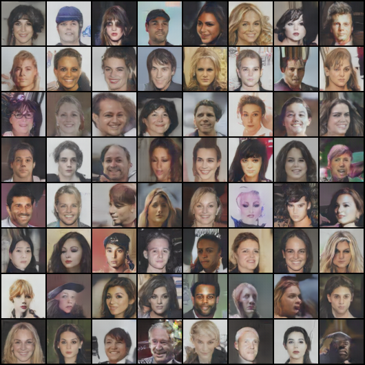

训练 loss 曲线：


训练过程中不同 epoch 的生成样本：

Epoch 5：

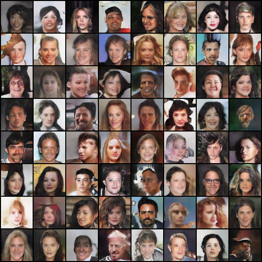

Epoch 25：

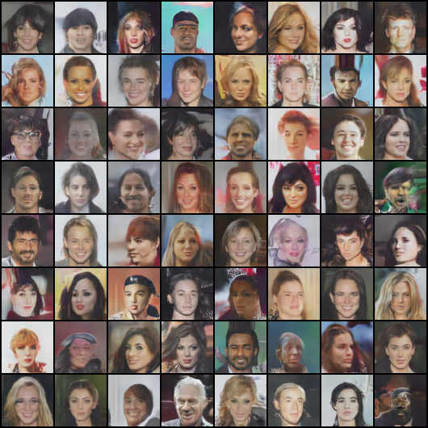

Epoch 50：


## 8. 使用的关键命令

### 8.1 最终训练命令

```bash
python -u scripts/train_dcgan.py \
  --dataset imagefolder \
  --data-root data/celeba_imagefolder \
  --epochs 50 \
  --batch-size 32 \
  --num-workers 8 \
  --lr 0.0002 \
  --feature-maps-g 128 \
  --feature-maps-d 64 \
  --output-dir outputs/celeba_final_bs32_g128_d64_e50 \
  --checkpoint-dir checkpoints/celeba_final_bs32_g128_d64_e50 \
  --sample-every 5 \
  --checkpoint-every 5 \
  --device cuda \
  2>&1 | tee logs/celeba_final_bs32_g128_d64_e50.log
```

### 8.2 最终评估命令

```bash
python scripts/evaluate_dcgan.py \
  --checkpoint checkpoints/celeba_final_bs32_g128_d64_e50/dcgan_latest.pt \
  --dataset imagefolder \
  --data-root data/celeba_imagefolder \
  --num-images 4096 \
  --batch-size 32 \
  --num-workers 8 \
  --feature-maps-g 128 \
  --device cuda
```

最终评估输出：

```text
num_images=4096
fid=16.393850
inception_score_mean=2.093219
inception_score_std=0.070783
```

### 8.3 插值实验命令

```bash
python scripts/interpolate.py \
  --checkpoint checkpoints/celeba_final_bs32_g128_d64_e50/dcgan_latest.pt \
  --output outputs/celeba_final_bs32_g128_d64_e50/interpolation.png \
  --feature-maps-g 128 \
  --device cuda
```

插值实验结果：


## 9. 报告中需要加入的文件

为了方便 Markdown 直接引用，已经把报告需要用到的图片整理到 `Image/` 目录：

```text
Image/final_samples_latest.png
Image/final_loss.svg
Image/final_interpolation.png
Image/final_samples_epoch_0005.png
Image/final_samples_epoch_0025.png
Image/final_samples_epoch_0050.png
```

最终评估输出可以直接使用第 8.2 节中的结果。如果需要保存为文件，可以执行：

```bash
python scripts/evaluate_dcgan.py \
  --checkpoint checkpoints/celeba_final_bs32_g128_d64_e50/dcgan_latest.pt \
  --dataset imagefolder \
  --data-root data/celeba_imagefolder \
  --num-images 4096 \
  --batch-size 32 \
  --num-workers 8 \
  --feature-maps-g 128 \
  --device cuda \
  2>&1 | tee outputs/celeba_final_bs32_g128_d64_e50/eval_fid_is_4096.txt
```

用于调参对比的文件：

```text
outputs/celeba_autotune_fast/summary.csv
outputs/celeba_autotune_fast/summary.json
```

可选加入报告的图片：

```text
Image/tune_baseline_bs128_g64_latest.png
Image/tune_stable_bs128_lr1e4_latest.png
Image/tune_smallbatch_bs64_g64_latest.png
Image/tune_largerg_bs64_g128_latest.png
```

调参阶段不同配置的生成样本：

baseline_bs128_lr2e4_g64_d64：

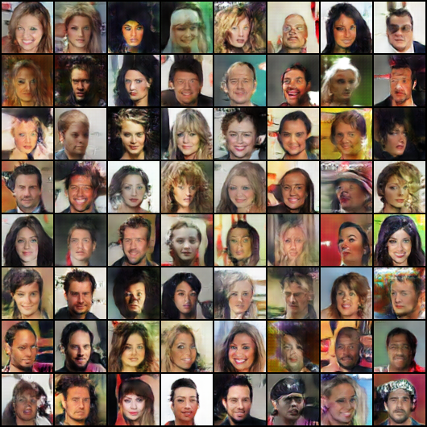

stable_bs128_lr1e4_g64_d64：

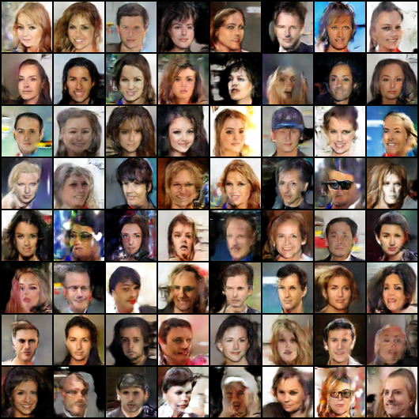

smallbatch_bs64_lr2e4_g64_d64：

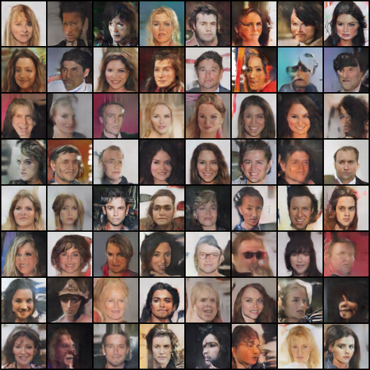

largerg_bs64_lr2e4_g128_d64：

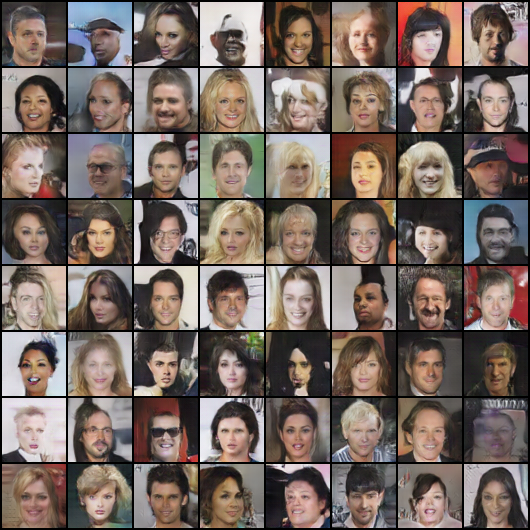

## 10. 可直接用于报告的文字

本实验基于 DCGAN 实现人脸图像生成。数据集采用 CelebA aligned face images，所有图像被统一缩放并裁剪到 `64 x 64`，随后归一化到 `[-1, 1]`。生成器输入为 128 维随机噪声，通过多层转置卷积逐步上采样，最终输出 `64 x 64` RGB 图像；判别器输入真实或生成图像，通过多层卷积判断图像为真实图像的概率。

训练过程中采用二元交叉熵损失函数和 Adam 优化器，设置 `beta1=0.5`、`beta2=0.999`。为了选择较优训练配置，我们比较了不同 batch size、学习率和生成器容量。初始实验表明，减小 batch size 和增大生成器容量可以有效降低 FID。进一步实验发现，当 `batch_size=32`、`lr=0.0002`、`feature_maps_g=128`、`feature_maps_d=64` 时，模型获得更好的生成质量。

最终模型在 RTX 4090 上训练 50 epoch，并使用 4096 张图像计算评估指标，得到 `FID=16.393850`、`IS=2.093219`。从 FID 结果看，生成图像分布已经较好地接近真实 CelebA 人脸图像分布。结合生成样本图和潜变量插值结果，可以观察到模型学习到了人脸整体结构，并能够在潜空间中生成连续变化的人脸图像。

## 11. 报告撰写仍需补充的内容

目前实验数据和图片已经足够完成基础实验部分。已经整理好的可视化内容包括：

- 最终生成样本图。
- 训练 loss 曲线。
- 潜变量线性插值图。
- 调参阶段不同配置的生成样本对比。

## 12. Bonus 实验：轻量化 StyleGAN 对比

为了完成 Bonus 中“对比改进 GAN 模型与基础模型性能差异”的要求，我们在 DCGAN baseline 之外实现并训练了一个 64x64 轻量化 StyleGAN 变体。该模型不是 NVIDIA 官方完整 StyleGAN 复现，而是保留了 StyleGAN 的核心思想：

- 使用 mapping network 将随机噪声 `z` 映射到风格空间 `w`。
- 使用 learned constant 作为生成起点。
- 在生成器卷积块中使用 AdaIN 进行风格调制。
- 使用 noise injection 引入局部随机细节。
- 支持在 `w` 空间进行潜变量插值。
- 使用 non-saturating logistic loss 和 R1 regularization 训练判别器。

因此，这部分实验主要用于展示 StyleGAN 相比 DCGAN 的生成机制改进和潜空间表达能力。

### 12.1 StyleGAN 自动调参设置

StyleGAN 调参使用脚本：

```bash
python scripts/auto_tune_stylegan.py \
  --dataset imagefolder \
  --data-root data/celeba_imagefolder \
  --device cuda \
  --num-workers 8 \
  --tune-epochs 50 \
  --final-epochs 100 \
  --eval-images 4096 \
  --eval-batch-size 32 \
  --sample-every 5 \
  --checkpoint-every 5 \
  --output-root outputs/stylegan_autotune \
  --checkpoint-root checkpoints/stylegan_autotune \
  --log-root logs/stylegan_autotune \
  --run-final
```

该脚本会依次完成：训练候选配置、计算 FID/IS、生成插值图、写入 `summary.csv` / `summary.json`、根据最低 FID 选择 winner，并使用 winner 参数进行最终训练。

调参候选配置如下，所有候选均使用 `generator_channels=128`、`discriminator_channels=64`、`style_dim=128`、`mapping_layers=4`，评估均使用 4096 张图像。

| 实验名称 | Epoch | Batch Size | 学习率 | beta1 | beta2 | R1 gamma | R1 every | FID ↓ | IS Mean ↑ | IS Std |
|---|---:|---:|---:|---:|---:|---:|---:|---:|---:|---:|
| bs32_lr2e4_r1_10 | 50 | 32 | 0.0002 | 0.0 | 0.99 | 10.0 | 16 | 29.257190 | 2.364138 | 0.070151 |
| bs32_lr1e4_r1_10 | 50 | 32 | 0.0001 | 0.0 | 0.99 | 10.0 | 16 | 45.198105 | 2.477224 | 0.064988 |
| bs64_lr2e4_r1_10 | 50 | 64 | 0.0002 | 0.0 | 0.99 | 10.0 | 16 | 35.587283 | 2.409524 | 0.073632 |
| bs32_lr2e4_r1_5 | 50 | 32 | 0.0002 | 0.0 | 0.99 | 5.0 | 16 | 28.921048 | 2.383427 | 0.075046 |

调参观察：

- 在本组实验中，`batch_size=32, lr=0.0002, r1_gamma=5` 的 FID 最低，作为 StyleGAN 最终训练配置。
- `lr=0.0001` 的 IS 最高，但 FID 明显变差，说明它生成的样本可能有一定多样性，但整体分布与真实 CelebA 的距离更大。
- 将 batch size 从 32 增大到 64 没有带来 FID 改善。
- 将 R1 gamma 从 10 降到 5 后，FID 从 `29.257190` 降到 `28.921048`，略有提升。

StyleGAN 调参阶段样本：

bs32_lr2e4_r1_10：

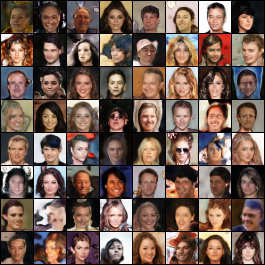

bs32_lr1e4_r1_10：

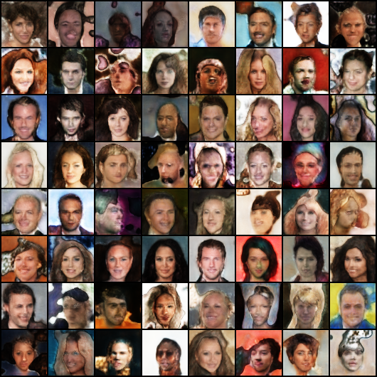

bs64_lr2e4_r1_10：

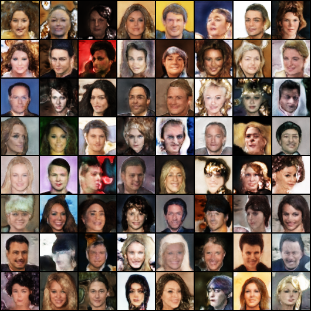

bs32_lr2e4_r1_5：

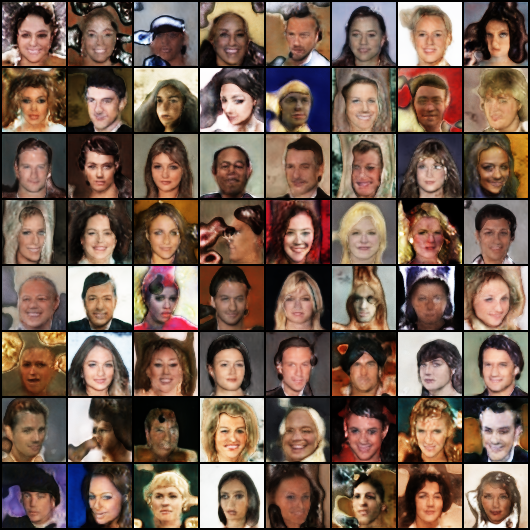

### 12.2 StyleGAN 最终训练结果

根据调参结果，最终 StyleGAN 配置为：

```text
batch_size = 32
lr = 0.0002
beta1 = 0.0
beta2 = 0.99
generator_channels = 128
discriminator_channels = 64
style_dim = 128
mapping_layers = 4
r1_gamma = 5.0
r1_every = 16
epochs = 100
```

最终模型使用 4096 张图像进行评估，结果如下：

| 模型 | Epoch | Batch Size | 学习率 | R1 gamma | 评估图像数 | FID ↓ | IS Mean ↑ | IS Std |
|---|---:|---:|---:|---:|---:|---:|---:|---:|
| StyleGAN-light final_bs32_lr2e4_r1_5_e100 | 100 | 32 | 0.0002 | 5.0 | 4096 | 23.114239 | 2.400094 | 0.062812 |

最终评估输出：

```text
num_images=4096
fid=23.114239
inception_score_mean=2.400094
inception_score_std=0.062812
```

最终生成样本：

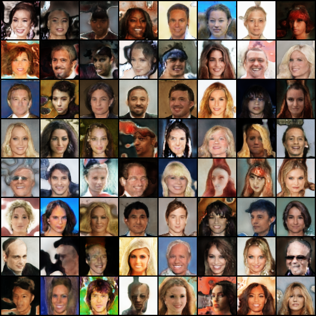

StyleGAN loss 曲线：


StyleGAN 训练过程中不同 epoch 的生成样本：

Epoch 50：

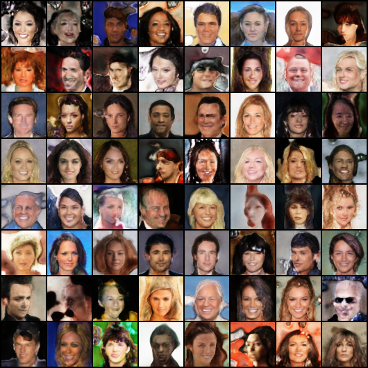

Epoch 100：

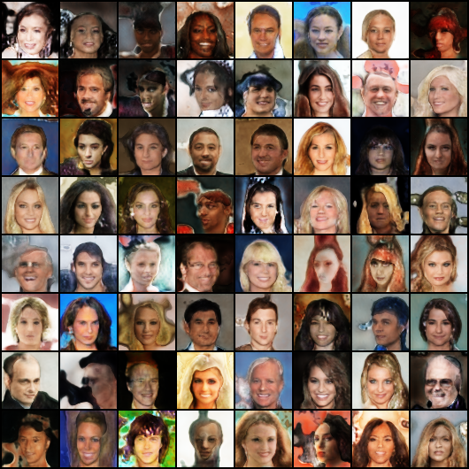

StyleGAN `w` 空间插值结果：


### 12.3 DCGAN 与 StyleGAN 对比

最终 DCGAN baseline 与 StyleGAN-light 的指标对比如下：

| 模型 | Epoch | 主要配置 | FID ↓ | IS Mean ↑ | IS Std |
|---|---:|---|---:|---:|---:|
| DCGAN | 50 | batch_size=32, lr=0.0002, G=128, D=64 | 16.393850 | 2.093219 | 0.070783 |
| StyleGAN-light | 100 | batch_size=32, lr=0.0002, R1 gamma=5 | 23.114239 | 2.400094 | 0.062812 |

对比观察：

- 从 FID 看，当前 StyleGAN-light 的 `23.114239` 仍高于 DCGAN 的 `16.393850`，说明在本实验设置下，StyleGAN-light 的整体分布拟合效果还没有超过充分调优的 DCGAN baseline。
- 从 Inception Score 看，StyleGAN-light 的 `2.400094` 高于 DCGAN 的 `2.093219`，说明 StyleGAN-light 生成样本在 Inception 分类空间中具有更高的多样性或可识别性。
- StyleGAN-light 支持 `w` 空间插值，相比 DCGAN 直接在 `z` 空间插值，具有更明确的潜空间表达和风格控制意义。
- FID 未超过 DCGAN 的原因可能包括：本实现是轻量化 StyleGAN 变体，未包含 EMA generator、style mixing、truncation trick、path length regularization 等完整 StyleGAN 训练技巧；同时本任务分辨率为 64x64，DCGAN 在该低分辨率人脸生成任务上本身就是较强 baseline。

因此，本实验中 DCGAN 在 FID 指标上更好；StyleGAN-light 则在 Inception Score、潜空间结构和生成机制可控性方面体现出改进模型的优势。

### 12.4 StyleGAN 相关文件

StyleGAN 结果文件位置：

```text
outputs/stylegan_autotune/summary.csv
outputs/stylegan_autotune/summary.json
outputs/stylegan_autotune/winner.json
outputs/stylegan_autotune/final_result.json
outputs/stylegan_autotune/final_bs32_lr2e4_r1_5_e100/eval_fid_is_4096.txt
outputs/stylegan_autotune/final_bs32_lr2e4_r1_5_e100/samples/latest.png
outputs/stylegan_autotune/final_bs32_lr2e4_r1_5_e100/loss.svg
outputs/stylegan_autotune/final_bs32_lr2e4_r1_5_e100/interpolation.png
```

已整理到 `Image/` 目录的 StyleGAN 图片：

```text
Image/stylegan_final_samples_latest.png
Image/stylegan_final_loss.svg
Image/stylegan_final_interpolation.png
Image/stylegan_final_samples_epoch_0050.png
Image/stylegan_final_samples_epoch_0100.png
Image/stylegan_tune_bs32_lr2e4_r1_10_latest.png
Image/stylegan_tune_bs32_lr1e4_r1_10_latest.png
Image/stylegan_tune_bs64_lr2e4_r1_10_latest.png
Image/stylegan_tune_bs32_lr2e4_r1_5_latest.png
```
